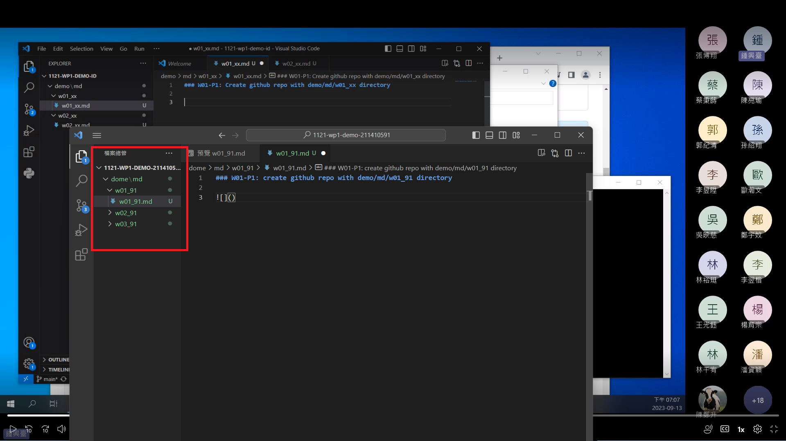
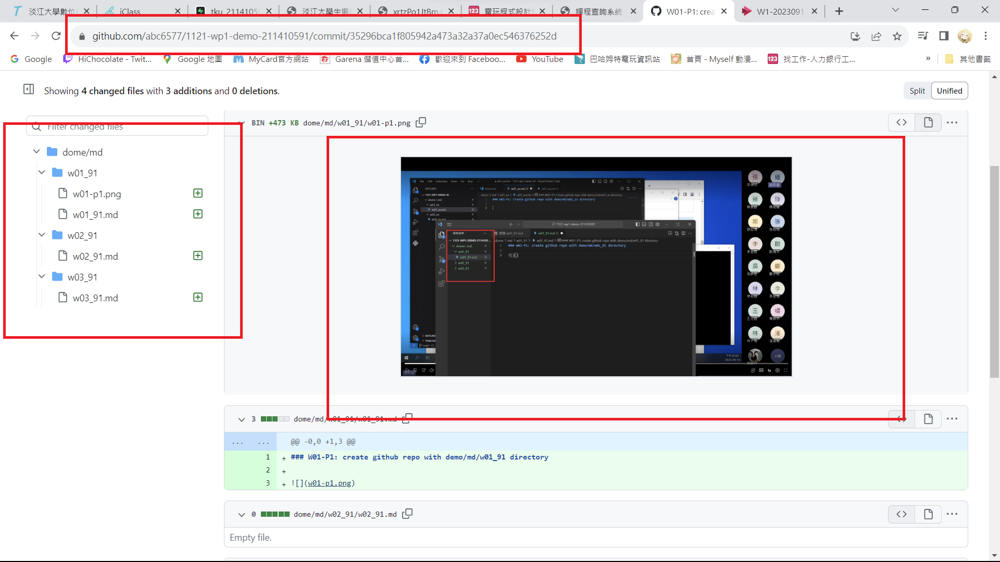
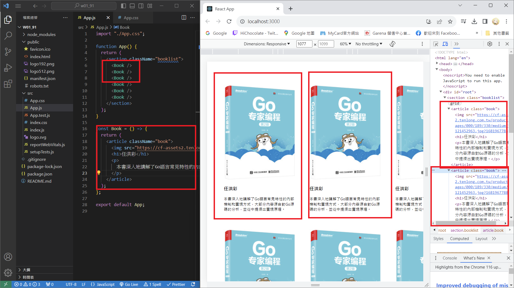
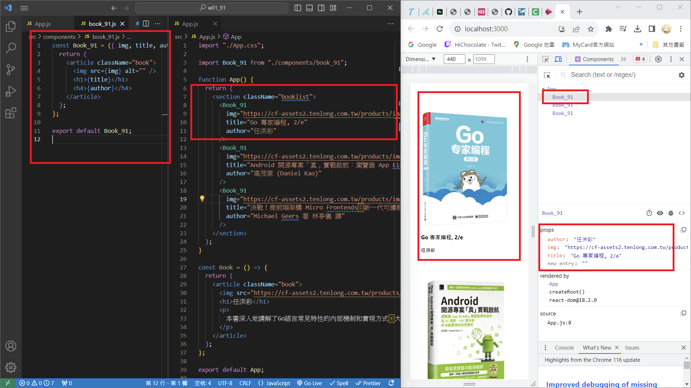
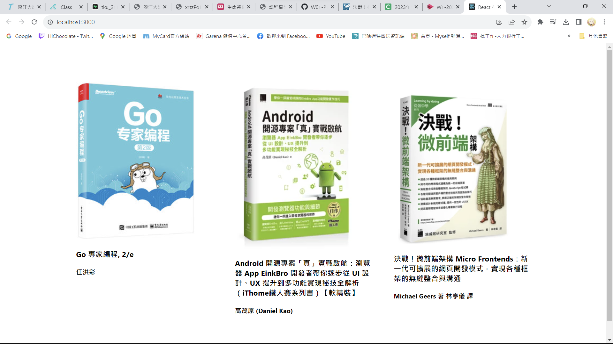

### W01-P1: create github repo with demo/md/w01_91 directory

### W01-P2: W01-P2: Display first two <Book />

### W01-P3: Display first <Book_xx />

### W01-P4: Display three different <Book_xx />, and show third <Book_xx> in Chrome DevTools

