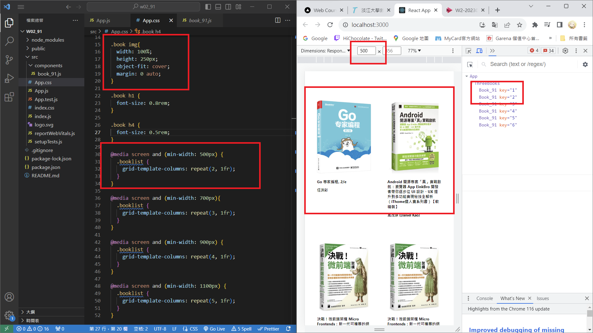
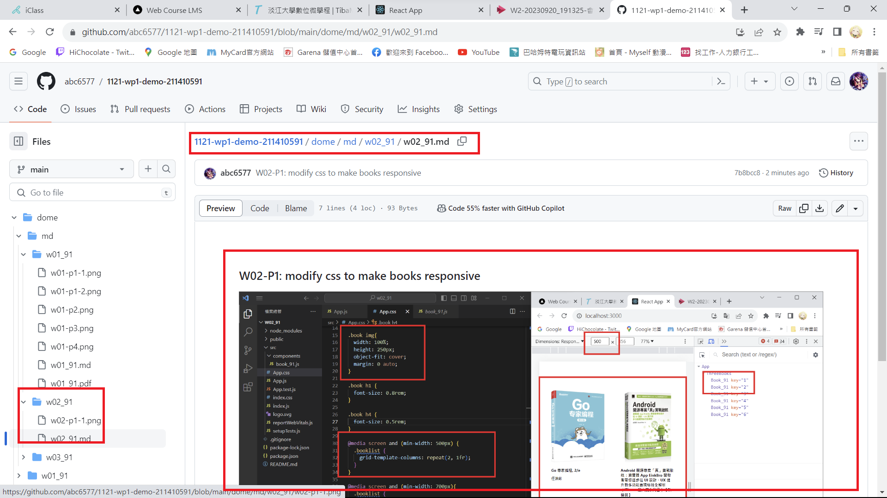
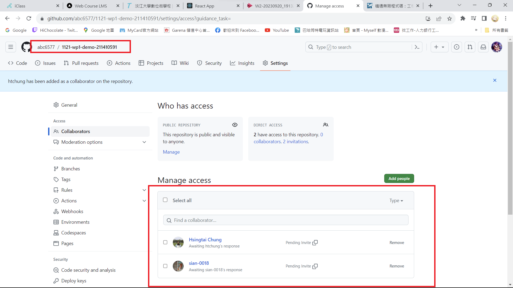
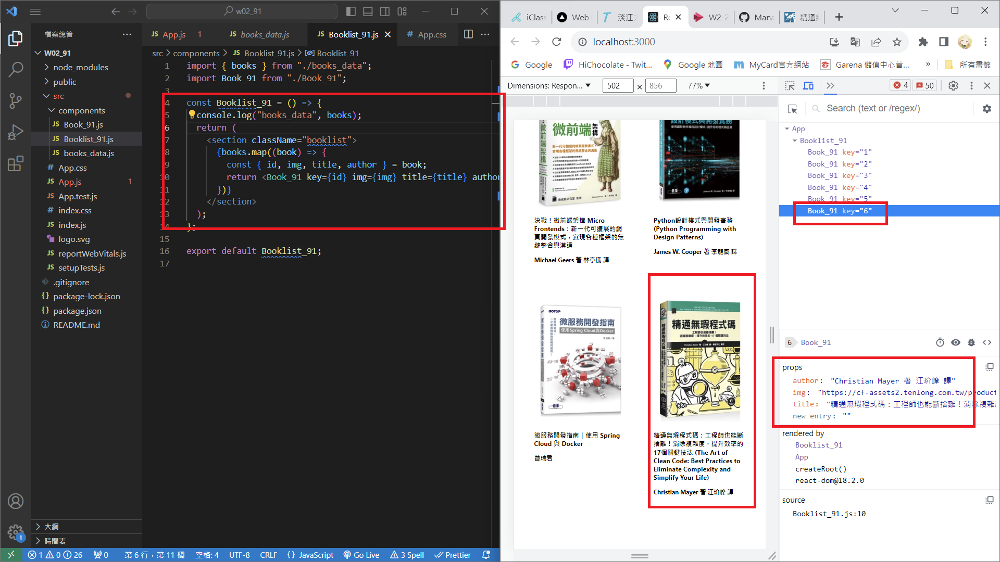
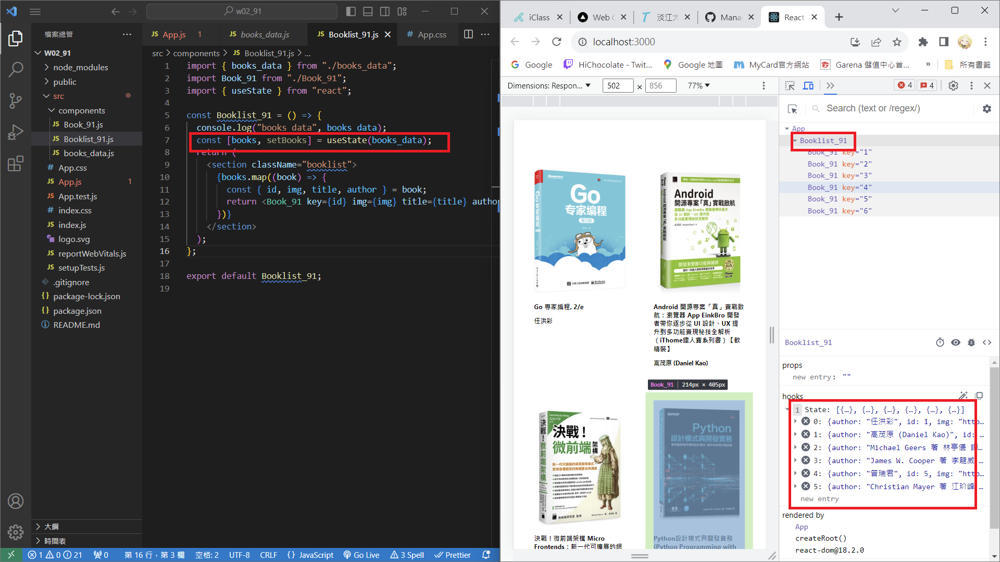

[My Github Repo URL](https://github.com/abc6577/1121-wp1-demo-211410591)

### W02-P1: modify css to make books responsive





### W02-P2: share Github repo to the teacher and TA



### W02-P3: Use <Booklist_xx> to show all books in books_data.js array



### W02-P4: Use useState hook to store all books in books_data.js array



```
$ git log --pretty=format:"%h%x09%an%x09%ad%x09%s" --after="2023-09-19"
989f2cf abc6577 Wed Sep 20 20:55:21 2023 +0800  W02-P3: Use <Booklist_xx> to show all books in books_data.js array
7b8bcc8 abc6577 Wed Sep 20 19:53:03 2023 +0800  W02-P1: modify css to make books responsive
```
