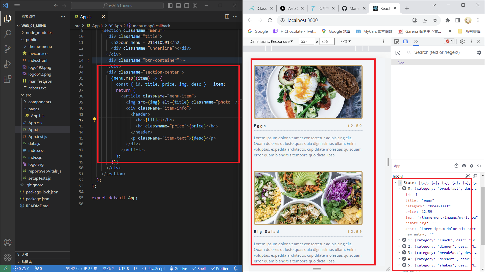
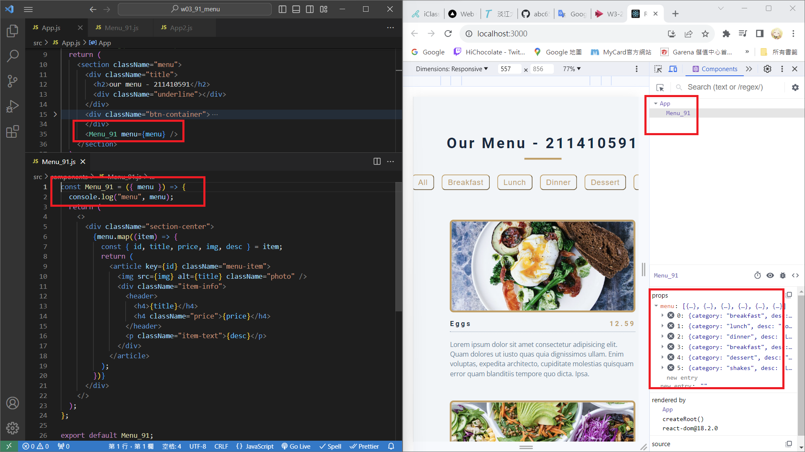
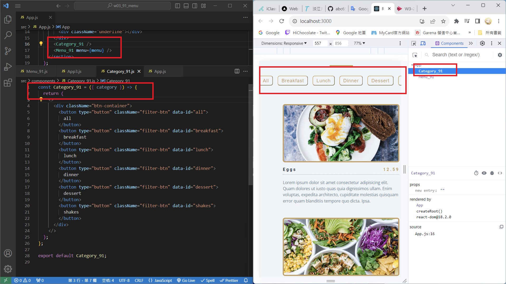
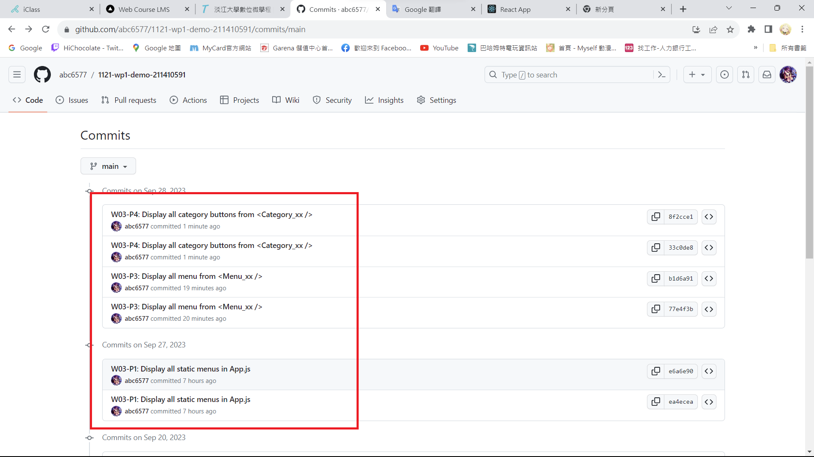

[My Github Repo URL](https://github.com/abc6577/1121-wp1-demo-211410591)

### W03-P1: Display all static menus in App.js


### W03-P2: Display all menu from an array data.js



### W03-P3: Display all menu from <Menu_xx />



### W03-P4: Display all category buttons from <Category_xx />



### W03-P5: show all git logs of W3



```
$ git log --pretty=format:"%h%x09%an%x09%ad%x09%s" --after="2023-09-26"
8f2cce1 abc6577 Thu Sep 28 04:39:28 2023 +0800  W03-P4: Display all category buttons from <Category_xx />
33c0de8 abc6577 Thu Sep 28 04:38:52 2023 +0800  W03-P4: Display all category buttons from <Category_xx />
b1d6a91 abc6577 Thu Sep 28 04:21:21 2023 +0800  W03-P3: Display all menu from <Menu_xx />
77e4f3b abc6577 Thu Sep 28 04:20:30 2023 +0800  W03-P3: Display all menu from <Menu_xx />
e6a6e90 abc6577 Wed Sep 27 21:40:52 2023 +0800  W03-P1: Display all static menus in App.js
ea4ecea abc6577 Wed Sep 27 21:40:17 2023 +0800  W03-P1: Display all static menus in App.js
```
